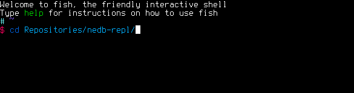

# nedb-repl
> The command-line tool for NeDB



[](https://travis-ci.org/nikolassilva/nedb-repl)
[](https://david-dm.org/nikolassilva/nedb-repl)
[](https://david-dm.org/nikolassilva/nedb-repl#info=devDependencies)

## Install
```bash
npm install -g nedb-repl
```

## Usage
```bash
$ nedb --help
```

## License
MIT © [Nikolas Silva](http://nikolas.com.br)
